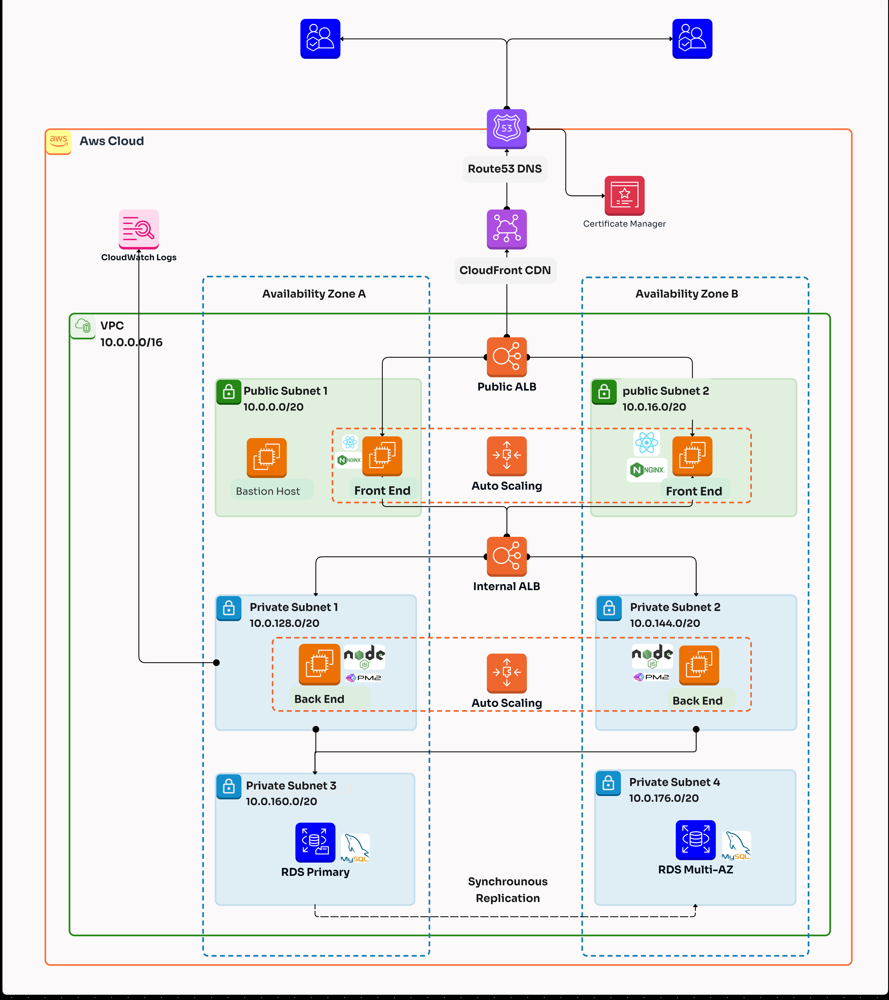

# Scalable 3-Tier Web Application on AWS

## Overview

This solution demonstrates a highly available and scalable 3-tier web application architecture deployed on AWS. The application implements best practices for compute scalability, security, and cost optimization using Amazon EC2, Application Load Balancer (ALB), Auto Scaling Groups (ASG), and Amazon RDS.

The architecture separates the presentation layer (React.js frontend), application logic layer (Express.js backend), and data layer (MySQL database) into distinct tiers, ensuring modularity, scalability, and maintainability.

## Architecture



### Architecture Components

**Presentation Tier:**
- Application Load Balancer distributing traffic across multiple availability zones
- Auto Scaling Group managing EC2 instances running NGINX and React.js frontend
- Cross-zone load balancing for high availability

**Application Tier:**
- Auto Scaling Group managing EC2 instances running Node.js/Express.js backend
- Internal Application Load Balancer for backend services
- PM2 process manager for Node.js application lifecycle management

**Data Tier:**
- Amazon RDS MySQL with Multi-AZ deployment for high availability
- Database subnet group spanning multiple availability zones
- Automated backups and maintenance windows

## AWS Services Used

| Service | Purpose | Configuration |
|---------|---------|---------------|
| **Amazon EC2** | Compute instances for web and application tiers | Auto Scaling Groups with t3.micro instances |
| **Application Load Balancer** | Traffic distribution and high availability | Health checks, sticky sessions, cross-zone balancing |
| **Auto Scaling Group** | Automatic capacity management | Scale-out at 70% CPU, scale-in at 30% CPU |
| **Amazon RDS** | Managed MySQL database | Multi-AZ, automated backups, maintenance windows |
| **Amazon VPC** | Network isolation and security | Public/private subnets, route tables, security groups |
| **AWS IAM** | Access control and permissions | Roles for EC2 instances, least privilege policies |
| **Amazon CloudWatch** | Monitoring and logging | Custom metrics, alarms, log aggregation |
| **Amazon SNS** | Notification service | Auto Scaling notifications, monitoring alerts |

## Key Features

### High Availability
- **Multi-AZ Deployment**: Resources distributed across multiple availability zones
- **Auto Scaling**: Automatic instance replacement and capacity adjustment
- **Database Failover**: RDS Multi-AZ provides automatic database failover
- **Load Balancing**: Traffic distributed across healthy instances only

### Scalability
- **Horizontal Scaling**: Auto Scaling Groups adjust capacity based on demand
- **Load Distribution**: Application Load Balancer efficiently routes requests
- **Database Performance**: RDS handles database scaling and optimization
- **Content Delivery**: NGINX serves static content efficiently

### Security
- **Network Segmentation**: Public subnets for load balancers, private subnets for application and database
- **Security Groups**: Restrictive firewall rules following least privilege principle
- **IAM Roles**: Secure access to AWS services without embedded credentials
- **Database Security**: Database instances isolated in private subnets

### Cost Optimization
- **Auto Scaling**: Reduces costs during low traffic periods
- **Instance Right-Sizing**: Appropriate instance types for workload requirements
- **Monitoring**: CloudWatch metrics enable resource optimization
- **Automated Management**: Reduced operational overhead

## Application Details

### Frontend (Presentation Tier)
- **Technology**: React.js with Vite build system
- **Web Server**: NGINX with reverse proxy configuration
- **Features**: Responsive design, API integration, health check endpoint
- **Deployment**: Built artifacts served by NGINX

### Backend (Application Tier)
- **Technology**: Node.js with Express.js framework
- **Process Management**: PM2 for application lifecycle management
- **Features**: RESTful API, database connectivity, logging
- **Monitoring**: CloudWatch Logs integration

### Database (Data Tier)
- **Technology**: MySQL 8.0 on Amazon RDS
- **Configuration**: Multi-AZ deployment, automated backups
- **Security**: Private subnet deployment, security group restrictions
- **Performance**: Optimized for application workload

## Deployment Guide

### Prerequisites
- AWS Account with appropriate IAM permissions
- AWS CLI configured with credentials
- Basic understanding of AWS services (VPC, EC2, RDS)

### Infrastructure Setup

#### 1. Network Configuration
```bash
# VPC with public and private subnets
# Internet Gateway for public subnet access
# NAT Gateway for private subnet internet access
# Route tables for traffic routing
```

#### 2. Security Groups
```bash
# ALB Security Group: HTTP/HTTPS from internet
# Web Tier Security Group: HTTP from ALB only
# App Tier Security Group: Application port from Web Tier only
# Database Security Group: MySQL port from App Tier only
```

#### 3. Database Setup
```bash
# RDS MySQL instance with Multi-AZ
# Database subnet group
# Parameter group optimization
# Automated backup configuration
```

### Application Deployment

#### 1. Launch Template Configuration
Use the provided user data scripts for automated instance configuration:

- **Presentation Tier**: Installs NGINX, clones repository, builds React app
- **Application Tier**: Installs Node.js, PM2, configures backend service
- **CloudWatch Integration**: Enables application logging to CloudWatch

#### 2. Auto Scaling Groups
```bash
# Presentation Tier ASG: Min 2, Max 10 instances
# Application Tier ASG: Min 2, Max 10 instances
# Scaling policies based on CPU utilization
# Health checks with ALB integration
```

#### 3. Load Balancer Configuration
```bash
# Public ALB for presentation tier
# Internal ALB for application tier
# Health check endpoints
# Target group configurations
```

## Monitoring and Logging

### CloudWatch Metrics
- EC2 instance metrics (CPU, memory, network)
- Auto Scaling Group metrics
- Application Load Balancer metrics
- RDS performance metrics

### Application Logging
- Backend application logs streamed to CloudWatch Logs
- NGINX access and error logs
- Database query logs for performance analysis

### Alerting
- SNS notifications for Auto Scaling events
- CloudWatch alarms for resource thresholds
- Database performance alerts

## Performance Optimization

### Auto Scaling Configuration
```bash
# Scale-out policy: CPU > 70% for 2 consecutive periods
# Scale-in policy: CPU < 30% for 2 consecutive periods
# Cooldown periods to prevent rapid scaling
# Instance warm-up time configuration
```

### Load Balancer Optimization
```bash
# Connection draining for graceful shutdowns
# Sticky sessions for stateful applications
# Health check optimization
# Cross-zone load balancing
```

### Database Performance
```bash
# RDS parameter group optimization
# Connection pooling in application
# Query optimization and indexing
# Read replica considerations for read-heavy workloads
```

## Security Best Practices

### Network Security
- Private subnets for application and database tiers
- Security groups with minimal required access
- NACLs for additional network-level security
- VPC Flow Logs for network monitoring

### Access Control
- IAM roles for EC2 instances (no embedded credentials)
- Least privilege principle for all permissions
- Regular security group audits
- AWS Systems Manager for secure instance access

### Data Protection
- RDS encryption at rest and in transit
- SSL/TLS certificates for web traffic
- Database connection encryption
- Regular automated backups

## Cost Management

### Resource Optimization
- Right-sized instances based on performance metrics
- Auto Scaling for dynamic capacity management
- Reserved Instances for predictable workloads
- Spot Instances for non-critical workloads (where applicable)

### Monitoring and Alerts
- AWS Cost Explorer for cost analysis
- Budget alerts for cost thresholds
- Resource utilization monitoring
- Unused resource identification

## Troubleshooting

### Common Issues
1. **Instance Launch Failures**: Check security groups, subnet configurations
2. **Database Connection Issues**: Verify security groups, connection strings
3. **Auto Scaling Issues**: Review scaling policies, health checks
4. **Load Balancer Health Checks**: Verify application endpoints, security groups

### Debugging Steps
```bash
# Check instance logs
sudo tail -f /var/log/cloud-init-output.log

# Verify application status
sudo systemctl status nginx
pm2 status

# Test connectivity
curl http://localhost/health
mysql -h <rds-endpoint> -u <username> -p
```

## Learning Outcomes

This project demonstrates proficiency in:

✅ **High Availability Architecture**
- Multi-AZ deployment strategies
- Auto Scaling Group configuration
- Load balancer implementation

✅ **Security Implementation**
- Network segmentation with VPC
- IAM roles and policies
- Security group configurations

✅ **Scalability Design**
- Horizontal scaling with Auto Scaling
- Load distribution strategies
- Database scaling considerations

✅ **Monitoring and Alerting**
- CloudWatch metrics and alarms
- Application logging strategies
- Performance monitoring

✅ **Cost Optimization**
- Auto Scaling for cost efficiency
- Resource right-sizing
- Monitoring and optimization strategies

## Future Enhancements

### Potential Improvements
- **CI/CD Pipeline**: AWS CodePipeline for automated deployments
- **Content Delivery**: CloudFront CDN for global content delivery
- **Containerization**: Migration to ECS or EKS for container orchestration
- **Microservices**: Breaking down application into microservices architecture
- **Caching**: ElastiCache implementation for improved performance
- **WAF Integration**: Web Application Firewall for enhanced security

### Monitoring Enhancements
- AWS X-Ray for distributed tracing
- Enhanced CloudWatch dashboards
- AWS Config for compliance monitoring
- AWS CloudTrail for API auditing

## Repository Structure
```
├── README.md
├── frontend/
│   ├── src/
│   ├── public/
│   │   └── ss/
│   │       ├── dfgfg.jpeg        # Architecture diagram
│   │       └── dashboard.png      # Application screenshot
│   ├── package.json
│   └── vite.config.js
├── backend/
│   ├── server.js
│   ├── db.sql                     # Database schema
│   ├── package.json
│   └── logs/
└── user-data-scripts/
    ├── presentation-tier.sh
    ├── application-tier.sh
    └── cloudwatch-config.sh
```

## Technical Specifications

| Component | Specification |
|-----------|---------------|
| **Instance Types** | t3.micro (adjustable based on workload) |
| **Operating System** | Amazon Linux 2 |
| **Database** | MySQL 8.0 Community Edition |
| **Web Server** | NGINX 1.20+ |
| **Application Runtime** | Node.js 18.x with PM2 |
| **Load Balancer** | Application Load Balancer (Layer 7) |
| **Auto Scaling** | Target Tracking Scaling Policy |

## Contributing

To contribute to this project:
1. Fork the repository
2. Create a feature branch
3. Make your changes
4. Test thoroughly
5. Submit a pull request

## Support

For questions or issues:
- Review the troubleshooting section
- Check AWS documentation
- Open an issue in this repository

## License

This project is available under the MIT License. See LICENSE file for details.

---

**Author**: Mohamed Serag  
**AWS Solutions Architect Associate Candidate**  
**Contact**: [mohamedserageddin12@gmail.com](mailto:mohamedserageddin12@gmail.com) | [LinkedIn Profile](www.linkedin.com/in/mohamed-serag-el-din-5595981b3)

*This project demonstrates AWS Solutions Architect Associate level competencies in designing and implementing scalable, secure, and cost-effective cloud architectures.*
